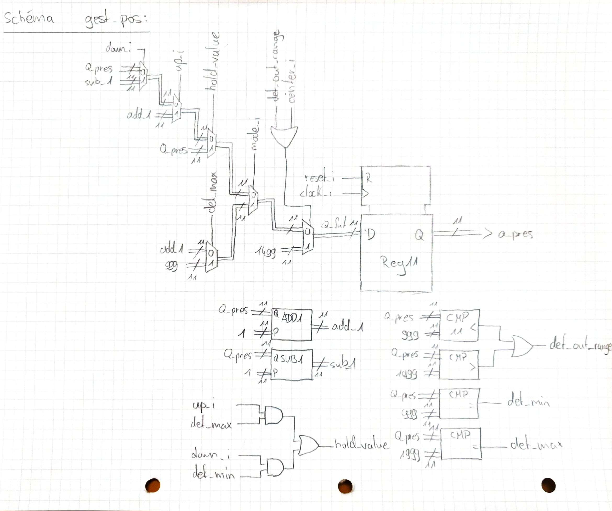
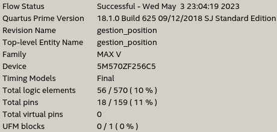

\center

# Manipulation 5: Servo-moteur commandé par PWM

\hfill\break

\hfill\break

Département: **TIC**

Unité d'enseignement: **CSN**

\hfill\break

\hfill\break

\hfill\break

\hfill\break

\hfill\break

\hfill\break

\hfill\break

\hfill\break

\raggedright

Auteur(s):

- **PILLONEL Bastien**

- **BOUGNON-PEIGNE Kévin**

Professeur:

- **MESSERLI Etienne**

Assistant:

- **JACCARD Anthony**

Date:

- 2023 

\pagebreak

# Introduction

Le but de ce laboratoire est de réaliser un système qui pilote un servo-moteur (abrégé *servo* pour le reste du rapport), sur commande par PWM (Pulse Width Modulation).

\hfill\break

## Objectif

Les objectifs sont de concevoir, développer, simuler et tester un contrôleur de servo-moteur, sous la forme d’un système séquentiel simple.

Le système utilise le principe d’un PWM ("Pulse Width Modulation" ou "modulation à largeur d’impulsion") qui permet de transmettre une information analogique via un signal binaire. Ce signal PWM est responsable de la transmission de la consigne de position au servo.

Le laboratoire est décomposé en deux parties. Dans la première partie il s’agit de générer un signal PWM à l’aide d’un compteur en "dent de scie" et d’une comparaison (plus d’explications dans la section "Première partie: Création du PWM"). Dans la deuxième partie il s’agit de gérer la position courante du servo, selon le mode de fonctionnement et l’état des signaux de commande (voir la section "Deuxième partie: Gestion de la position").

\hfill\break

## Remarque sur les vues technologic

Les vues technologic ont été exportées en PDF et fusionner avec l'outil en ligne [ILovePdf](https://www.ilovepdf.com/merge_pdf), en utilisant l'utilitaire fournit par Quartus.

De part leur taille, ils seront alors annexés à la fin du rapport, pour ne pas surcharger le contenu du rapport lui-même. Ainsi qu'introduit dans l'archive de rendu.

\hfill\break

## Matériel utilisé

- Carte de développement: MAX_V_80P_25P, avec carte Mezzanine pour servo-moteur, avec un exemplaire du dit servo.

- Oscilloscope de la marque Tektronix

- Alimentation de laboratoire, 2 sorties: 1) 5V/???A 2) 12V/???A

- Logiciels: Quartus et Questasim

\pagebreak

## Spécification

### PWM: Pulse Width Modulation

Un PWM est un signal carré de période fixe, à rapport cyclique changeant. Pour réaliser ce genre de signal, l'on se base sur un signal triangulaire (ou en dent de scie, dans le cas présent) et on le compare avec un signal de contrôle.

\hfill\break

Voici une démonstration:

\center

{ width=60% }

\raggedright

\hfill\break

### Comportement du servo

Dans le cadre de ce laboratoire, le PWM du servo fonctionne selon ces informations:

\center

{ width=70% }

\raggedright

\pagebreak

# Analyse

## Première partie: Génération du PWM

Soit le bloc de cette partie représentée par:

\center

{ width=40% }

\raggedright

\hfill\break

Il est souhaité de générer un PWM selon les caractérstiques suivantes:

\center

{ width=90% }

\raggedright

\hfill\break

Pour générer ce PWM, voici les fonctions nécessaires:

- asynchrone: Reset

- synchrone&nbsp;: Un compteur de la période du PWM

- synchrone&nbsp;: Un élément mémoire pour le compteur précédent

- synchrone&nbsp;: Un rebouclement de ce compteur (chargement à 0)

- synchrone&nbsp;: Un comparateur entre le compteur de la période du PWM et le seuil d'entrée, pour fixer la sortie pwm_o, soit à '1', soit à '0'.

\pagebreak

Selon la liste précédente, on voit que la table de fonctions synchrones ne peut faire intervenir que les éléments liés au compteur. Car l'entrée **seuil_i** et la sortie **pwm.o** sont régies par la règle:

```python
pwm_o = '1' if cpt_period <= seul_i else '0'
```

qui permet de générer le PWM.

\hfill\break

On obtient alors le décodeur d'états futurs du compteur:

| top_1MHz_i | cpt_period | cpt_fut_period | Commentaires |
| :--------: | :--------- | :------------- | :----------- |
| 0 | - | =cpt_period | Maintien des valeurs |
| 1 | =19999 | =0 | Rebouclement de la période |
| 1 | / | =cpt_period+1 | Incrémentation du compteur |

\hfill\break

Le schéma attendu sera montré en chapitre "Réalisation et Implémentation", afin de le comparer avec la vue RTL du bloque.

\pagebreak

## Deuxième partie: Gestion de la position

Voici tout d'abord la liste des entrées et sortie de notre bloc "gestion de position":

\center

{ width=30% }

\raggedright

\hfill\break

Les fonctions nécessaires sont:

- asynchrone: reset

- synchrone&nbsp;:  un compteur/décompteur pour le temps de l'impulsion haute ($T_{on}$)

- synchrone&nbsp;: un élément mémoire pour le compteur précédent

- synchrone&nbsp;: un rebouclement du compteur, lorsqu'il au maximum de $T_{on}$ (pour le mode automatique)

- synchrone&nbsp;: un détecteur des limites "min" et "max" de $T_{on}$, avec maintien de la valeur une fois arrivé en buté (pour le mode manuel)

    - De plus, il faut charger une valeur de $T_{on}$ correspondant à la position centrale, si $T_{on}$ est hors limites

_Note: Le compteur définit le temps haut_ $T_{on}$. _Le compteur peut alors prendre comme valeur minimale 999, correspondant à un_ $T_{on}$ _de 1\[ms\] et une valeur maximale de 1999, correspondant à un_ $T_{on}$ _de 2\[ms\]._

\hfill\break

Si l'on reprend la donnée du labo, on remarque qu'il est important de donner des priorités pour chaque fonction:

1. Chargement pos. centrale si hors limite

2. Chargement pos. centrale si center_i actif

3. Boucle d'incrémentation si mode_i est actif (mode auto)

4. Incrément jusqu'à $T_{on}$ max puis maintien si up_i actif

5. Décrément jusqu'à $T_{on}$ min puis maintien si down_i

\pagebreak

Voici alors la table de fonctions synchrones:

| center_i | mode_i | up_i | down_i | reg_pres | reg_fut | Commentaires |
| :---: | :---: | :-: | :---: | :------ | :--------- | :----------- |
| / | / | / | / | <999 ou >1999 | =1499 | Chargement pos. centrale si hors limite |
| 1 | / | / | / | / | =1499 | Chargement pos. centrale |
| / | 1 | / | / | =1999 | =999 | Rebouclement |
| / | 1 | / | / | autres | =reg_pres+1 | Incrément (mode auto.) |
| / | / | 1 | / | =1999 | =reg_pres | Maintien |
| / | / | 1 | / | autres | =reg_pres+1 | Incrément (mode man.) |
| / | / | / | 1 | =999 | =reg_pres | Maintien |
| / | / | / | 1 | autres | =reg_pres-1 | Soustraction |

\hfill\break

Un premier regroupement des valeurs de *reg_pres*, égalent à "autres", peut être effectuer, on obtient donc la table suivante:

| center_i | mode_i | up_i | down_i | reg_pres | reg_fut | Commentaires |
| :---: | :---: | :-: | :---: | :------ | :--------- | :----------- |
| / | / | / | / | <999 ou >1999 | =1499 | Chargement pos. centrale si hors limite |
| 1 | / | / | / | / | =1499 | Chargement pos. centrale |
| / | 1 | / | / | =1999 | =999 | Rebouclement |
| / | / | 1 | / | =1999 | =reg_pres | Maintien |
| / | / | / | 1 | =999 | =reg_pres | Maintien |
| / | / | / | 1 | autres | =reg_pres-1 | Soustraction |
| / | / | / | / | autres | =reg_pres+1 | Incrément |

L'addition et la soustraction peuvent être effectuer par le même bloc additionneur (pour une soustraction, on met le report d'entrée à '1' et on inverse le second nombre d'entrée).

\pagebreak

On peut donc coupler ces états et terminer avec la table suivante:

| center_i | mode_i | up_i | down_i | reg_pres | reg_fut | Commentaires |
| :---: | :---: | :-: | :---: | :------ | :------------- | :----------- |
| / | / | / | / | <999 ou >1999 | =1499 | Chargement pos. centrale si hors limite |
| 1 | / | / | / | / | =1499 | Chargement pos. centrale |
| / | 1 | / | / | =1999 | =999 | Rebouclement |
| / | / | 1 | / | =1999 | =reg_pres | Maintien |
| / | / | / | 1 | =999 | =reg_pres | Maintien |
| / | / | / | / | autres | =reg_pres "op." 1 | Incrément/Soustraction |

\hfill\break

Comme pour la partie de génération PWM, le schéma estimé sera présenté en titre "Réalisation et Implémentation" pour être comparé avec la vue RTL.

\pagebreak

# Réalisation et implantation

\hfill\break

## Première partie: Génération du PWM

\hfill\break

### Comparaison des schémas: Esquisse papier VS vue RTL

\center

{ width=70% }

\raggedright

\hfill\break


\hfill\break

On voit que la vue RTL correspond bien au schéma attendu.

\hfill\break

*Remarque: La valeur héxadécimal 0x4E20 correspond à 20'000 et la condition est strictement plus petite, soit bien 19'999 comme énoncé avec la table de fonctions synchrones*

\pagebreak

## Deuxième partie: Gestion de la position

\hfill\break

### Comparaison des schémas: Esquisse papier VS vue RTL

\center

{ width=70% }

\raggedright

\hfill\break


\hfill\break

Ici encore, la vue RTL correspond bien à l'esquisse effectuée.

\pagebreak

# Simulation

\hfill\break

## Log de simulation

```shell
# vsim work.servo_pwm_tb
# Start time: 22:25:21 on May 02,2023
# ** Note: (vsim-8009) Loading existing optimized design _opt2
# Loading std.standard
# Loading std.textio(body)
# Loading ieee.std_logic_1164(body)
# Loading ieee.numeric_std(body)
# Loading ieee.fixed_float_types
# Loading ieee.math_real(body)
# Loading ieee.fixed_generic_pkg(body)
# Loading ieee.float_generic_pkg(body)
# Loading ieee.fixed_pkg
# Loading ieee.float_pkg
# Loading work.servo_pwm_tb(test_bench)#1
# Loading work.ilog_pkg(body)
# Loading work.servo_pwm_top(struct)#1
# Loading work.top_gen(calc)#1
# Loading work.top_gen(calc)#2
# Loading work.gestion_position(logic)#1
# Loading work.pwm(comp)#1
```

\pagebreak

# Intégration/Mesure

L'intégration nous fourni l'analyse et le système complet comporte alors **140 éléments logiques**:

\center

{ width=55% }

\raggedright

\hfill\break

## Schéma de mesure

Les mesures ont étés prises en branchant une sonde d'oscilloscope sur la sortie du PWM, afin de mesurer le temps d'impulsion haute du signal.

\hfill\break

Soit la pseudo représentation de la Mezzanine, le branchement de mesure se présente comme suit:

\center

{ width=55% }

\raggedright

\pagebreak

## Angle maximale

\hfill\break

\center

{ width=80% }

\raggedright

\hfill\break

\center

{ width=80% }

\raggedright

\pagebreak

## Angle milieu

\hfill\break

\center

{ width=80% }

\raggedright

\hfill\break

\center

{ width=80% }

\raggedright

## Angle minimale

\hfill\break

\center

{ width=80% }

\raggedright

\hfill\break

\center

{ width=80% }

\raggedright

\pagebreak

## Constat et tests effectués après intégration

Selon ce qui était demandé, le système respecte les contraintes du systèmes.

Notes supplémentaires: En mode manuel, les butées sont maintenues lors de la pression continu des boutons "up_i" et "down_i".

Le mouvement incrémentale est bien prioritaire sur le mouvement décrémentale.

En pressant tous les boutons simultanément, c'est bien la position de centrage qui est prioritaire.

La priorité de la position centrale est aussi respectée en mode automatique et reste fixé, tant que le bouton "center_i" n'est pas relâché.

Le rebouclement du mode automatique s'effectue correctement.

Et dernier test, le reset insère '0' dans le registre de position et le centrage est alors bien la première position, une fois le reset relâché.

\hfill\break

# Conclusion

Pour conclure, nous avons pu vérifier que le laboratoire est fonctionnel, à l'aide du testbench et de l'intégration sur la carte MAXV. Les mesures à l'ocilloscope ont pu le démontrer.

Nous disposons tout de même d'une version plus optimisée qui n'utilise qu'un seul additioneur qui gère:

- et la décrémentation et l'incrémentation en mode automatique

- ainsi que l'addition en mode automatique

Mais par manque de temps pour identifier les 7 erreurs du testbench, cette option n'a pas été validée par l'assistant. Toutefois, elle est développée en annexe.

Au total, le système comporte alors **140 logic éléments**, avec respectivement 33 éléments logiques pour la partie PWM et 56 pour la gestion de position (les résultats d'analyse sont annexés à la fin du rapport).

\raggedleft

\hfill\break

Date: 3 Mai 2023

**PILLONEL Bastien**

**BOUGNON-PEIGNE Kévin**

\raggedright

\pagebreak

# Annexe(s)

- Résultat d'analyse des parties

- Résultat de simulation

- Vues Technologic de PWM et Gestion de la position

- pwm.vhd

- gestion_position.vhd

- Gestion position optimisée

    - Schéma attendu
    
    - Vue RTL

    - gestion_position.vhd (optimisé)

\hfill\break

## Résultat d'analyse des parties

### Analyse PWM

\center

{ width=70% }

\raggedright

\hfill\break

### Analyse Gestion de la position

\center

{ width=70% }

\raggedright

\pagebreak

## Résultat de la simulation

\hfill\break

\scriptsize

```shell
# ** Note: Debut de la simulation
#    Time: 0 ns  Iteration: 0  Instance: /servo_pwm_tb
# ** Warning: NUMERIC_STD.TO_INTEGER: metavalue detected, returning 0
#    Time: 0 ns  Iteration: 0  Instance: /servo_pwm_tb/dut/pwm_inst
# ** Error: (vsim-86) Argument value -2147483647 is not in bounds of subtype NATURAL.
#    Time: 0 ns  Iteration: 0  Instance: /servo_pwm_tb/dut/pwm_inst
# ** Warning: NUMERIC_STD.TO_UNSIGNED: vector truncated
#    Time: 0 ns  Iteration: 0  Instance: /servo_pwm_tb/dut/pwm_inst
# ** Warning: NUMERIC_STD.TO_INTEGER: metavalue detected, returning 0
#    Time: 0 ns  Iteration: 0  Instance: /servo_pwm_tb/dut/pwm_inst
# ** Warning: NUMERIC_STD."<": metavalue detected, returning FALSE
#    Time: 0 ns  Iteration: 0  Instance: /servo_pwm_tb/dut/gest_pos
# ** Warning: NUMERIC_STD.">": metavalue detected, returning FALSE
#    Time: 0 ns  Iteration: 0  Instance: /servo_pwm_tb/dut/gest_pos
# ** Warning: NUMERIC_STD."=": metavalue detected, returning FALSE
#    Time: 0 ns  Iteration: 0  Instance: /servo_pwm_tb/dut/gest_pos
# ** Warning: NUMERIC_STD."=": metavalue detected, returning FALSE
#    Time: 0 ns  Iteration: 0  Instance: /servo_pwm_tb/dut/gest_pos
# ** Warning: NUMERIC_STD."=": metavalue detected, returning FALSE
#    Time: 0 ns  Iteration: 0  Instance: /servo_pwm_tb/dut/gen_top_2ms
# ** Warning: NUMERIC_STD."/=": metavalue detected, returning TRUE
#    Time: 0 ns  Iteration: 0  Instance: /servo_pwm_tb/dut/gen_top_2ms
# ** Warning: NUMERIC_STD."=": metavalue detected, returning FALSE
#    Time: 0 ns  Iteration: 0  Instance: /servo_pwm_tb/dut/gen_top_1MHz
# ** Warning: NUMERIC_STD."/=": metavalue detected, returning TRUE
#    Time: 0 ns  Iteration: 0  Instance: /servo_pwm_tb/dut/gen_top_1MHz
# ** Warning: NUMERIC_STD.TO_INTEGER: metavalue detected, returning 0
#    Time: 0 ns  Iteration: 1  Instance: /servo_pwm_tb/dut/pwm_inst
# ** Warning: NUMERIC_STD."=": metavalue detected, returning FALSE
#    Time: 0 ns  Iteration: 1  Instance: /servo_pwm_tb/dut/gen_top_2ms
# ** Note: top_2ms OK
#    Time: 666734 ns  Iteration: 0  Instance: /servo_pwm_tb
# ** Note: testcase_upanddown done
#    Time: 1321914082 ns  Iteration: 3  Instance: /servo_pwm_tb
# ** Note: testcase_tocenter done
#    Time: 3136914082 ns  Iteration: 3  Instance: /servo_pwm_tb
# ** Note: testcase_automode done
#    Time: 3237894082 ns  Iteration: 3  Instance: /servo_pwm_tb
# ** Note: testcase_errors done
#    Time: 3340194082 ns  Iteration: 3  Instance: /servo_pwm_tb
# ** Note: Fin de la simulation
#    Time: 3340194082 ns  Iteration: 3  Instance: /servo_pwm_tb
# ** Note: NOMBRE D'ERREURS : 0
#    Time: 3340194082 ns  Iteration: 3  Instance: /servo_pwm_tb
# ** Note: VOUS ETES LES MEILLEURS!!!
#    Time: 3340194082 ns  Iteration: 3  Instance: /servo_pwm_tb
```

\normalsize

\pagebreak

## Vues Technologic de PWM et Gestion de la position

\pagebreak

## pwm.vhd

\hfill\break

\scriptsize
<!--\footnotesize-->

```vhdl
library ieee;
use ieee.std_logic_1164.all;
use ieee.numeric_std.all;

entity pwm is
    port (-- Sync
          clock_i     : in std_logic;
          reset_i     : in std_logic;
          -- Inputs
          top_1MHz_i  : in std_logic;
          seuil_i     : in std_logic_vector(14 downto 0); -- range: [0, 2000]
          -- Outputs
          pwm_o       : out std_logic
    );
end entity pwm;

architecture comp of pwm is
    -- TO COMPLETE: Signals declaration
    --| Signals |---------------------------------------------------------------
    -- Period counter with range [0, 20000] <=> 15bits needed
    signal cpt_period_reg_pres_s : unsigned(seuil_i'range);
    signal cpt_period_reg_fut_s  : unsigned(seuil_i'range);
    signal pwm_s                 : std_logic;

    begin
    -- TO COMPLETE: Sawtooth counter generation
    -- Hold current value when top 1MHz ("enable" like) is down
    -- Add1 or Loop period's counter otherwise
    cpt_period_reg_fut_s <= cpt_period_reg_pres_s     when top_1MHz_i = '0'              else
                            cpt_period_reg_pres_s + 1 when cpt_period_reg_pres_s < 20000 else
                            to_unsigned(0, cpt_period_reg_fut_s'length);

    -- D Flip-Flop / Register
    process(reset_i, clock_i)
      --
    begin
      if reset_i = '1' then
        cpt_period_reg_pres_s <= (others => '0');
      elsif rising_edge(clock_i) then
        cpt_period_reg_pres_s <= cpt_period_reg_fut_s;
      end if;
    end process;

    -- TO COMPLETE: PWM signal generation and output
    -- Comparator 
    -- Variant1: Compare directly period counter with threshold
    pwm_s <= '1' when cpt_period_reg_pres_s <= unsigned(seuil_i) else
             '0';
    -- Variant2: First comparison with cpt_period > 20'000
    --           and then compare specific range with threshold
    --pwm_s <= '0' when cpt_period_reg_pres_s              >= 2000                           else
    --         '0' when cpt_period_reg_pres_s(10 downto 0) >  unsigned(seuil_i(10 downto 0)) else
    --         '1';
    
    pwm_o <= pwm_s;

end architecture;
```

\normalsize

\pagebreak

## gestion_position.vhd

\hfill\break

\scriptsize

```vhdl
library ieee;
use ieee.std_logic_1164.all;
use ieee.numeric_std.all;

entity gestion_position is
    port (-- Sync
          clock_i     : in std_logic;
          reset_i     : in std_logic;
          -- Inputs
          down_i      : in std_logic;
          up_i        : in std_logic;
          mode_i      : in std_logic;
          top_2ms_i   : in std_logic;
          center_i    : in std_logic;
          -- Outputs
          position    : out std_logic_vector(10 downto 0)
    );
end entity gestion_position;

architecture logic of gestion_position is
    --| Signals |---------------------------------------------------------------
    signal Q_pres_s, Q_fut_s, add_1_s, sub_1_s, mode_select_s, going_up_s, manual_mode_s : std_logic_vector(10 downto 0);
    
    signal det_min_s, det_max_s, det_out_range_s, center_s, enable_count_s, hold_value_s : std_logic;

    signal count_value_s    : unsigned(10 downto 0);

    --| Constants |-------------------------------------------------------------
    constant COUNT_MAX : unsigned(10 downto 0) := "11111001111"; -- unsigned 1999
    constant COUNT_MIN : unsigned(10 downto 0) := "01111100111"; -- unsigned 999
    constant COUNT_MID : unsigned(10 downto 0) := "10111011011"; -- unsigned 1499

    begin
    -- TO COMPLETE: Calculate position
    -- Intern signal to enable the flipflop during max Ton of the pwm
    enable_count_s  <=  top_2ms_i;

    det_max_s       <= '1' when count_value_s = COUNT_MAX else
                       '0';
    det_min_s       <= '1' when count_value_s = COUNT_MIN else 
                       '0';
    det_out_range_s <= '1' when (count_value_s < COUNT_MIN OR count_value_s > COUNT_MAX) else 
                       '0';

    count_value_s   <= unsigned(Q_pres_s);
    add_1_s         <= std_logic_vector(count_value_s + 1);
    sub_1_s         <= std_logic_vector(count_value_s - 1);

    center_s        <= det_out_range_s or center_i;
    hold_value_s    <= (up_i and det_max_s) or (down_i and det_min_s);
```

\pagebreak

```vhdl
    -- Decoder of futur state
    going_up_s      <=  std_logic_vector(COUNT_MIN) when det_max_s = '1' else
                        add_1_s;

    manual_mode_s   <=  Q_pres_s when hold_value_s = '1' else
                        add_1_s  when up_i = '1'         else 
                        sub_1_s  when down_i = '1'       else
                        Q_pres_s;

    mode_select_s   <=  going_up_s when mode_i = '1' else 
                        manual_mode_s;

    Q_fut_s         <=  std_logic_vector(COUNT_MID) when center_s = '1' else
                        mode_select_s;

    -- Process of a enabled flipflop
    process(reset_i, clock_i)
    begin
        -- reset the flip flop
        if reset_i = '1' then
            Q_pres_s  <= (others => '0');
        elsif rising_edge(clock_i) then
            if enable_count_s = '1' then
                Q_pres_s  <= Q_fut_s;
            end if;
        end if;
  
    end process;

    -- TO COMPLETE: Position output
    position <= Q_pres_s;

end logic;
```

\normalsize

\pagebreak

## Gestion position optimisée

Une seconde version, plus optimale, de la gestion de position a été réalisée.

À l'intégration, cette solution est complètement fonctionnelle, les mesures sont identiques aux précédentes inclues dans le rapport et est constitué de **120 éléments logiques**, avec 33 et 36 éléments logiques, respectivement pour `pwm.vhd` et `gestion_position.vhd`.

Au total, c'est 20 éléments de moins que la solutions développée plus haut.

Voici plus de détails:

\center

{ width=60% }

\raggedright

\hfill\break

Cette dernière n'a pas été vérifiée par l'assistant, car il restait 7 erreurs à la simulation et le temps manquait pour vérifier l'origine de chacune d'entre-elles.

\hfill\break

Voici les logs de simulation:

\scriptsize

```shell
# vsim -voptargs=""+acc"" work.servo_pwm_tb
# Start time: 11:44:16 on May 03,2023
# ** Note: (vsim-3812) Design is being optimized...
# Loading std.standard
# Loading std.textio(body)
# Loading ieee.std_logic_1164(body)
# Loading ieee.numeric_std(body)
# Loading ieee.fixed_float_types
# Loading ieee.math_real(body)
# Loading ieee.fixed_generic_pkg(body)
# Loading ieee.float_generic_pkg(body)
# Loading ieee.fixed_pkg
# Loading ieee.float_pkg
# Loading work.servo_pwm_tb(test_bench)#1
# Loading work.ilog_pkg(body)
# Loading work.servo_pwm_top(struct)#1
# Loading work.top_gen(calc)#1
# Loading work.top_gen(calc)#2
# Loading work.gestion_position(logic)#1
# Loading work.pwm(comp)#1
```

\normalsize

\pagebreak

Erreurs obtenues:

\scriptsize

```shell
# ** Note: Debut de la simulation
#    Time: 0 ns  Iteration: 0  Instance: /servo_pwm_tb
# ** Warning: NUMERIC_STD."<=": metavalue detected, returning FALSE
#    Time: 0 ns  Iteration: 0  Instance: /servo_pwm_tb/dut/pwm_inst
# ** Warning: NUMERIC_STD."<": metavalue detected, returning FALSE
#    Time: 0 ns  Iteration: 0  Instance: /servo_pwm_tb/dut/pwm_inst
# ** Warning: NUMERIC_STD."=": metavalue detected, returning FALSE
#    Time: 0 ns  Iteration: 0  Instance: /servo_pwm_tb/dut/gest_pos
# ** Warning: NUMERIC_STD.">": metavalue detected, returning FALSE
#    Time: 0 ns  Iteration: 0  Instance: /servo_pwm_tb/dut/gest_pos
# ** Warning: NUMERIC_STD."=": metavalue detected, returning FALSE
#    Time: 0 ns  Iteration: 0  Instance: /servo_pwm_tb/dut/gest_pos
# ** Warning: NUMERIC_STD."<": metavalue detected, returning FALSE
#    Time: 0 ns  Iteration: 0  Instance: /servo_pwm_tb/dut/gest_pos
# ** Warning: NUMERIC_STD."=": metavalue detected, returning FALSE
#    Time: 0 ns  Iteration: 0  Instance: /servo_pwm_tb/dut/gen_top_2ms
# ** Warning: NUMERIC_STD."/=": metavalue detected, returning TRUE
#    Time: 0 ns  Iteration: 0  Instance: /servo_pwm_tb/dut/gen_top_2ms
# ** Warning: NUMERIC_STD."=": metavalue detected, returning FALSE
#    Time: 0 ns  Iteration: 0  Instance: /servo_pwm_tb/dut/gen_top_1MHz
# ** Warning: NUMERIC_STD."/=": metavalue detected, returning TRUE
#    Time: 0 ns  Iteration: 0  Instance: /servo_pwm_tb/dut/gen_top_1MHz
# ** Warning: NUMERIC_STD."<=": metavalue detected, returning FALSE
#    Time: 0 ns  Iteration: 1  Instance: /servo_pwm_tb/dut/pwm_inst
# ** Warning: NUMERIC_STD."=": metavalue detected, returning FALSE
#    Time: 0 ns  Iteration: 1  Instance: /servo_pwm_tb/dut/gen_top_2ms
# ** Warning: NUMERIC_STD."<=": metavalue detected, returning FALSE
#    Time: 0 ns  Iteration: 4  Instance: /servo_pwm_tb/dut/pwm_inst
# ** Note: top_2ms_o OK
#    Time: 666734 ns  Iteration: 0  Instance: /servo_pwm_tb
# ** Error: >>>ERROR in pwm_o PWM duty cycle: expected between 49450 ns and 49483 ns but got 49500 ns
#    Time: 1369615 ns  Iteration: 3  Instance: /servo_pwm_tb
# ** Error: >>>ERROR incorrect freq on pwm_o: expected between 600000 ns and 733333 ns but got 57717 ns
#    Time: 166386082 ns  Iteration: 5  Instance: /servo_pwm_tb
# ** Error: >>>ERROR in pwm_o PWM duty cycle: expected between 57733 ns and 57766 ns but got 33 ns
#    Time: 166386115 ns  Iteration: 3  Instance: /servo_pwm_tb
# ** Note: testcase_upanddown done
#    Time: 1321980082 ns  Iteration: 3  Instance: /servo_pwm_tb
# ** Error: >>>ERROR incorrect freq on pwm_o: expected between 600000 ns and 733333 ns but got 48543 ns
#    Time: 1669932082 ns  Iteration: 5  Instance: /servo_pwm_tb
# ** Error: >>>ERROR in pwm_o PWM duty cycle: expected between 49483 ns and 49516 ns but got 957 ns
#    Time: 1669933039 ns  Iteration: 3  Instance: /servo_pwm_tb
# ** Error: >>>ERROR incorrect freq on pwm_o: expected between 600000 ns and 733333 ns but got 596442 ns
#    Time: 2689634524 ns  Iteration: 3  Instance: /servo_pwm_tb
# ** Error: >>>ERROR in pwm_o PWM duty cycle: expected between 49483 ns and 49516 ns but got 54219 ns
#    Time: 2876478082 ns  Iteration: 5  Instance: /servo_pwm_tb
# ** Note: testcase_tocenter done
#    Time: 3143580082 ns  Iteration: 3  Instance: /servo_pwm_tb
# ** Note: testcase_automode done
#    Time: 3244626082 ns  Iteration: 3  Instance: /servo_pwm_tb
# ** Note: testcase_errors done
#    Time: 3346926082 ns  Iteration: 3  Instance: /servo_pwm_tb
# ** Note: Fin de la simulation
#    Time: 3346926082 ns  Iteration: 3  Instance: /servo_pwm_tb
# ** Note: NOMBRE D'ERREURS : 7
#    Time: 3346926082 ns  Iteration: 3  Instance: /servo_pwm_tb
# ** Note: IL FAUT CONTINUER...
#    Time: 3346926082 ns  Iteration: 3  Instance: /servo_pwm_tb
```

\normalsize

\hfill\break

Toutefois, certaines erreurs ont été analysées et se trouvent être, comme le cas où on a une erreur de rapport cyclique à 33\[ns\], dû à des glitchs de simulations.

### Schéma attendu VS vue RTL

\hfill\break

\center

{ width=80% }

\hfill\break


\raggedright

\hfill\break

Les deux vues sont identiques, si ce n'est la gestion du carry. Cette partie étant gérée avec des `unsigned`, en utilisant le `addn` d'un laboratoire précédent, il serait possible de mieux se rapprocher de l'ébauche papier.

\pagebreak

### gestion_position.vhd (optimisé)

\hfill\break

\scriptsize

```vhdl
library ieee;
use ieee.std_logic_1164.all;
use ieee.numeric_std.all;

entity gestion_position is
    port (-- Sync
          clock_i     : in std_logic;
          reset_i     : in std_logic;
          -- Inputs
          down_i      : in std_logic;
          up_i        : in std_logic;
          mode_i      : in std_logic;
          top_2ms_i   : in std_logic;
          center_i    : in std_logic;
          -- Outputs
          position    : out std_logic_vector(10 downto 0)
    );
end entity gestion_position;

architecture logic of gestion_position is
    --| Signals |---------------------------------------------------------------
    signal reg_pres_s, reg_fut_s : unsigned(position'range);
    signal le_999_s , eq_999_s   : std_logic;
    signal gt_1999_s, eq_1999_s  : std_logic;

    signal sub_carry_s           : std_logic;
    signal cst_one_s             : unsigned(position'range);
    signal reg_plus_minus_one_s  : unsigned(position'range);

    signal center_out_limits_s      : std_logic;
    signal up_limit_s, down_limit_s : unsigned(position'range);
    signal loop_auto_mode_s         : unsigned(position'range);

    --| Constants |-------------------------------------------------------------
    constant LIMIT_UPPER_BOUND : unsigned(position'range) :=
	                                         to_unsigned(1999, position'length);
    constant CENTER_VAL        : unsigned(position'range) :=
	                                         to_unsigned(1499, position'length);
    constant LIMIT_LOWER_BOUND : unsigned(position'range) :=
	                                         to_unsigned( 999, position'length);
```

\pagebreak

```vhdl
    begin
    -- TO COMPLETE: Calculate position
    -- Add 1 / Sub 1 part
    sub_carry_s <= down_i and (not up_i) and (not mode_i);
    cst_one_s   <= not to_unsigned(0, cst_one_s'length) when sub_carry_s = '1' else
                   to_unsigned( 1, cst_one_s'length);
    reg_plus_minus_one_s <= reg_pres_s + cst_one_s;
	 
    -- In between signals
    center_out_limits_s  <= center_i or le_999_s or gt_1999_s;
	 
    loop_auto_mode_s <= LIMIT_LOWER_BOUND when eq_1999_s = '1' else
                        reg_plus_minus_one_s;
	 
    up_limit_s <= reg_pres_s            when eq_1999_s = '1' else
                  reg_plus_minus_one_s;
						
    down_limit_s <= reg_pres_s          when eq_999_s = '1' else
                    reg_plus_minus_one_s;
						  
    -- Main separation of Futur States Decoder
    reg_fut_s <= CENTER_VAL       when center_out_limits_s = '1'  else
                 loop_auto_mode_s when mode_i = '1'               else
                 up_limit_s       when up_i = '1'                 else
                 down_limit_s     when down_i = '1'               else
                 reg_pres_s;

    -- D Flip-Flop / Register
    process(reset_i, clock_i)
      --
    begin
      if reset_i = '1' then
        reg_pres_s <= (others => '0');
      elsif rising_edge(clock_i) then
        if top_2ms_i = '1' then
          reg_pres_s <= reg_fut_s;
        end if;
      end if;
    end process;
    
    -- TO COMPLETE: Position output
    position <= std_logic_vector(reg_pres_s);

    le_999_s <= '1' when reg_pres_s < LIMIT_LOWER_BOUND else
                '0';
    eq_999_s <= '1' when reg_pres_s = LIMIT_LOWER_BOUND else
                '0';

    gt_1999_s <= '1' when reg_pres_s > LIMIT_UPPER_BOUND else
                 '0';
    eq_1999_s <= '1' when reg_pres_s = LIMIT_UPPER_BOUND else
                 '0';

end logic;
```

\normalsize

